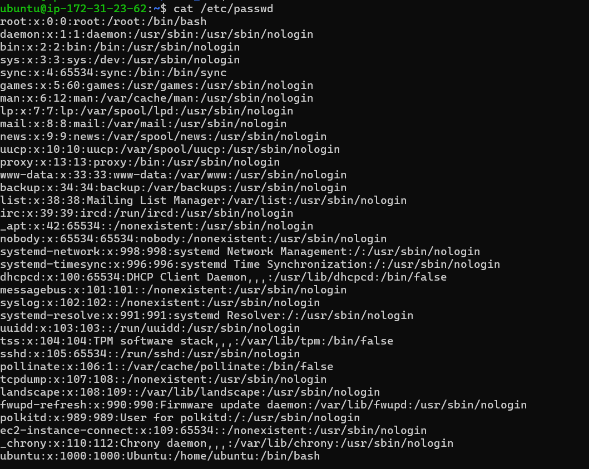
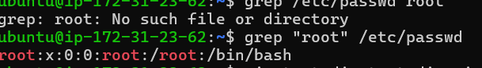
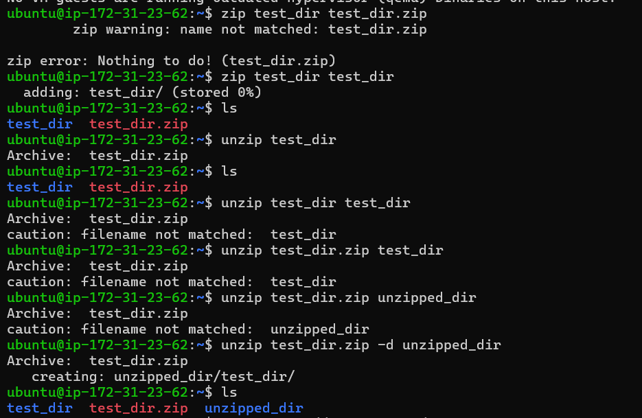
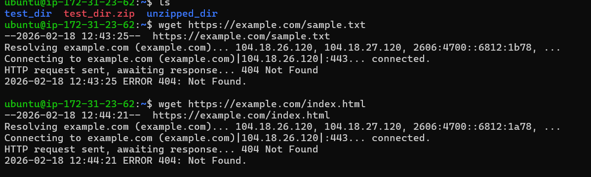
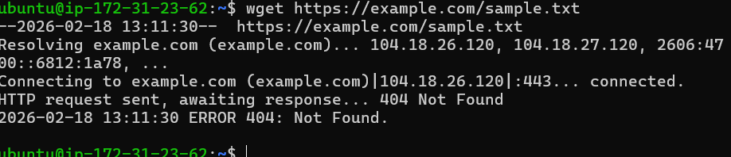

# TuteDude-DevOps-Linux-Basics
My first assignment on Linux basics of DevOps course.
# Linux Basics Assignment - TuteDude

## Task 1: Creating and Renaming Files
**Commands used:** `mkdir test_dir`, `touch example.txt`, `mv example.txt renamed_example.txt`

## Task 2: Viewing File Contents
**Commands used:** `cat /etc/passwd`, `head -n 5 /etc/passwd`, `tail -n 5 /etc/passwd`

# Linux Basics Assignment - TuteDude

## Task 2.1: Creating and Renaming Files
**Commands used:** `mkdir test_dir`, `touch example.txt`, `mv example.txt renamed_example.txt`

## Task 3: Viewing File Contents
**Commands used:** `cat /etc/passwd`, `head -n 5 /etc/passwd`, `tail -n 5 /etc/passwd`

# Linux Basics Assignment - TuteDude

## Task 4: Creating and Renaming Files
**Commands used:** `mkdir test_dir`, `touch example.txt`, `mv example.txt renamed_example.txt`

## Task 4.1: Viewing File Contents
**Commands used:** `cat /etc/passwd`, `head -n 5 /etc/passwd`, `tail -n 5 /etc/passwd`

# Linux Basics Assignment - TuteDude

## Task 5: Creating and Renaming Files
**Commands used:** `mkdir test_dir`, `touch example.txt`, `mv example.txt renamed_example.txt`

## Task 6: Viewing File Contents
**Commands used:** `cat /etc/passwd`, `head -n 5 /etc/passwd`, `tail -n 5 /etc/passwd`

# Linux Basics Assignment - TuteDude

## Task 7: Creating and Renaming Files
**Commands used:** `mkdir test_dir`, `touch example.txt`, `mv example.txt renamed_example.txt`

